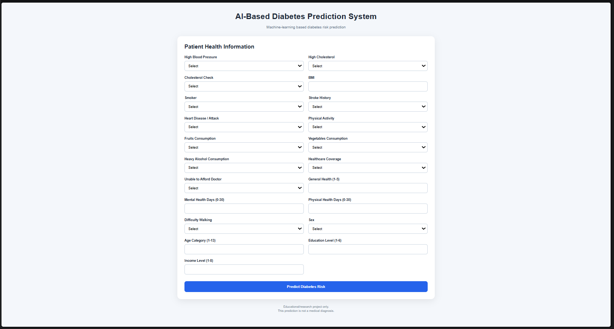
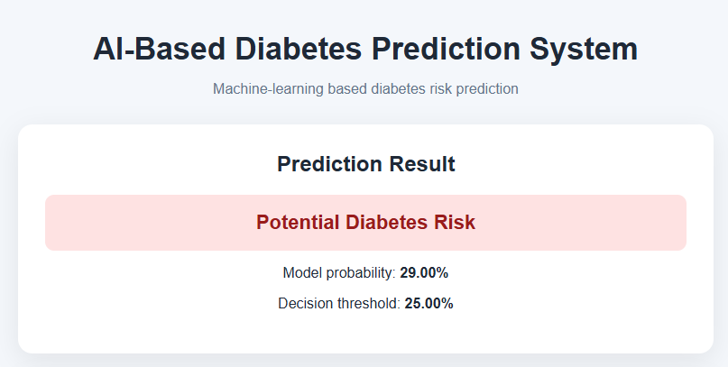

<p align="center">
  <b>🩺 AI-Based Diabetes Prediction System</b><br>
  <sub>Machine Learning • Healthcare Analytics • Flask Web Application</sub>
</p>

---

# 🩺 AI-Based Diabetes Prediction System

An end-to-end **Machine Learning and Flask-based web application** that predicts diabetes risk from health and lifestyle indicators.

The project uses a **Random Forest Classifier** and includes data cleaning, exploratory data analysis, preprocessing, model training, evaluation, probability threshold analysis, feature-importance analysis, prediction testing, and an interactive web interface.

> **Disclaimer:** This system is intended for educational, academic, and research purposes. Its predictions are Machine Learning outputs and are **not medical diagnoses** or a substitute for professional medical advice.

---

# 📌 Project Overview

The system applies supervised Machine Learning to historical health-indicator data and predicts whether an input record belongs to the **Diabetic** or **Non-Diabetic** class.

The complete workflow is:

```text
Dataset
   ↓
Data Cleaning
   ↓
Exploratory Data Analysis
   ↓
Train/Test Split
   ↓
Feature Scaling
   ↓
Random Forest Training
   ↓
Model Evaluation
   ↓
Threshold Analysis
   ↓
Saved Model
   ↓
Flask Web Application
   ↓
Diabetes Risk Prediction
```

---

# 🎯 Objectives

- Build a supervised Machine Learning system for diabetes-risk prediction.
- Clean and preprocess healthcare data.
- Remove duplicate records.
- Handle class imbalance using a balanced Random Forest.
- Train and evaluate a classification model.
- Analyze probability thresholds.
- Identify important predictive features.
- Build an interactive Flask application.
- Provide probability-based prediction results.
- Organize the project as a GitHub-ready portfolio project.

---

# ✨ Key Features

### 🧹 Data Cleaning
- Duplicate detection and removal
- Missing-value checking
- Target/feature separation
- Stratified train/test splitting

### 📊 Exploratory Data Analysis
- Diabetes-class distribution
- BMI distribution
- Age distribution
- Correlation heatmap
- Confusion matrix
- ROC curve
- Feature importance
- Threshold analysis

### 🧠 Machine Learning
- Random Forest Classifier
- 200 decision trees
- Balanced class weights
- StandardScaler preprocessing
- Probability-based prediction

### 🌐 Web Application
- Flask backend
- Interactive prediction form
- Model probability display
- Configured decision threshold
- Human-readable prediction result
- Responsive CSS interface

---

# 📊 Dataset

The project uses:

```text
data/diabetes_binary_health.csv
```

Dataset summary:

| Property | Value |
|---|---:|
| Original records | 253,680 |
| Columns | 22 |
| Input features | 21 |
| Target column | Diabetes_binary |
| Missing values | 0 |
| Duplicate records | 24,206 |
| Clean records | 229,474 |

## Target Variable

```text
Diabetes_binary
```

| Value | Meaning |
|---:|---|
| 0 | Non-Diabetic |
| 1 | Diabetic |

## Class Distribution

| Class | Records | Percentage |
|---|---:|---:|
| Non-Diabetic | 218,334 | 86.07% |
| Diabetic | 35,346 | 13.93% |

The dataset is therefore class-imbalanced.

---

# 📋 Input Features

The model uses these 21 features:

```text
HighBP
HighChol
CholCheck
BMI
Smoker
Stroke
HeartDiseaseorAttack
PhysActivity
Fruits
Veggies
HvyAlcoholConsump
AnyHealthcare
NoDocbcCost
GenHlth
MentHlth
PhysHlth
DiffWalk
Sex
Age
Education
Income
```

### Feature Categories

| Category | Features |
|---|---|
| Health | HighBP, HighChol, Stroke, HeartDiseaseorAttack |
| Lifestyle | Smoker, PhysActivity, Fruits, Veggies, HvyAlcoholConsump |
| General Health | GenHlth, MentHlth, PhysHlth, DiffWalk |
| Demographic | Sex, Age, Education, Income |
| Healthcare Access | CholCheck, AnyHealthcare, NoDocbcCost |
| Body Measurement | BMI |

> **Dataset limitation:** The current dataset does not contain a direct glucose feature, so the application does not invent or request glucose values.

---

# 🧹 Dataset After Cleaning

```text
Original records: 253,680
Duplicates removed: 24,206
Clean records: 229,474
```

Exact duplicate rows are removed before the train/test split.

---

# 🏗️ System Architecture

```text
                  ┌──────────────────────┐
                  │        User          │
                  └──────────┬───────────┘
                             │
                             ▼
                  ┌──────────────────────┐
                  │    Flask Web App     │
                  └──────────┬───────────┘
                             │
                             ▼
                  ┌──────────────────────┐
                  │   Input Validation   │
                  └──────────┬───────────┘
                             │
                             ▼
                  ┌──────────────────────┐
                  │    StandardScaler    │
                  └──────────┬───────────┘
                             │
                             ▼
                  ┌──────────────────────┐
                  │  Random Forest Model │
                  └──────────┬───────────┘
                             │
                             ▼
                  ┌──────────────────────┐
                  │ Probability + Class  │
                  └──────────┬───────────┘
                             │
                             ▼
                  ┌──────────────────────┐
                  │     Result Page      │
                  └──────────────────────┘
```

---

# 🧠 Machine Learning Model

## Random Forest Classifier

The project uses a **Random Forest Classifier**.

| Parameter | Value |
|---|---:|
| Algorithm | Random Forest Classifier |
| Number of trees | 200 |
| Random state | 42 |
| Class weight | balanced |
| Train/test split | 80/20 |
| Feature scaling | StandardScaler |
| Training samples | 183,579 |
| Test samples | 45,895 |

The model is trained using the cleaned dataset and saved together with the scaler, feature names, and application threshold.

---

# 📈 Model Performance

Current held-out test-set results:

| Metric | Score |
|---|---:|
| Accuracy | **84.39%** |
| Precision | **46.79%** |
| Recall | **14.85%** |
| F1-Score | **22.54%** |
| ROC-AUC | **78.17%** |

### Classification Report

| Class | Precision | Recall | F1-Score |
|---|---:|---:|---:|
| Non-Diabetic | 0.86 | 0.97 | 0.91 |
| Diabetic | 0.47 | 0.15 | 0.23 |
| Macro Avg | 0.67 | 0.56 | 0.57 |
| Weighted Avg | 0.80 | 0.84 | 0.81 |

Because the dataset is imbalanced, accuracy is reported together with precision, recall, F1-score, and ROC-AUC.

---

# 🎚️ Threshold Analysis

The model probability threshold was evaluated at several values:

| Threshold | Accuracy | Precision | Recall | F1 |
|---:|---:|---:|---:|---:|
| 0.50 | 84.39% | 46.90% | 15.40% | 23.19% |
| 0.45 | 84.09% | 45.80% | 21.98% | 29.71% |
| 0.40 | 83.54% | 44.30% | 29.72% | 35.57% |
| 0.35 | 82.32% | 41.56% | 38.42% | 39.93% |
| 0.30 | 80.44% | 38.67% | 47.54% | 42.65% |
| **0.25** | **77.65%** | **35.57%** | **56.89%** | **43.77%** |
| 0.20 | 73.98% | 32.72% | 66.43% | 43.85% |

The current application uses:

```text
Prediction threshold: 0.25
```

This is a **project-level modeling choice**, not a medical diagnostic threshold.

---

# 🔎 Feature Importance

Top features from the current Random Forest:

| Rank | Feature | Importance |
|---:|---|---:|
| 1 | BMI | 0.172524 |
| 2 | Age | 0.130076 |
| 3 | GenHlth | 0.091870 |
| 4 | Income | 0.088264 |
| 5 | PhysHlth | 0.073338 |
| 6 | HighBP | 0.073042 |
| 7 | Education | 0.061790 |
| 8 | MentHlth | 0.055016 |
| 9 | HighChol | 0.036154 |
| 10 | Smoker | 0.029822 |

Complete values are stored in:

```text
outputs/feature_importance.csv
```

> Feature importance describes model behavior and should not be interpreted as proof of causation.

---

# 🌐 Web Application

The Flask application accepts the available health and lifestyle indicators through an interactive form.

The application:

1. Collects the input values.
2. Converts them to numeric values.
3. Aligns them with the model feature order.
4. Applies the saved StandardScaler.
5. Generates a positive-class probability.
6. Applies the configured threshold.
7. Displays the prediction and probability.

Example output:

```text
Potential Diabetes Risk

Model Probability: 29.00%
Decision Threshold: 25.00%

Result: Diabetic
```

This example demonstrates software behavior only and is not a medical assessment.

---

# 📁 Generated Outputs

```text
outputs/
├── diabetes_distribution.png
├── bmi_distribution.png
├── age_distribution.png
├── correlation_heatmap.png
├── confusion_matrix.png
├── roc_curve.png
├── classification_report.txt
├── feature_importance.csv
└── threshold_analysis.csv
```

---

# 📁 Project Structure

```text
AI_Diabetes_Prediction_System/
│
├── data/
│   └── diabetes_binary_health.csv
│
├── models/
│   └── diabetes_model.joblib
│
├── notebooks/
│
├── outputs/
│   ├── diabetes_distribution.png
│   ├── bmi_distribution.png
│   ├── age_distribution.png
│   ├── correlation_heatmap.png
│   ├── confusion_matrix.png
│   ├── roc_curve.png
│   ├── classification_report.txt
│   ├── feature_importance.csv
│   └── threshold_analysis.csv
│
├── src/
│   ├── __init__.py
│   ├── data_preprocessing.py
│   ├── eda.py
│   ├── evaluate.py
│   ├── predict.py
│   ├── test_prediction.py
│   ├── threshold_analysis.py
│   └── train.py
│
├── static/
│   └── style.css
│
├── templates/
│   └── index.html
│
├── app.py
├── train_model.py
├── requirements.txt
├── README.md
└── .gitignore
```

> The dataset CSV and trained `.joblib` model are excluded from GitHub by `.gitignore` in the current setup.

---

# ⚙️ Installation

## 1. Clone the Repository

After publishing the repository:

```bash
git clone <your-github-repository-url>
cd AI_Diabetes_Prediction_System
```

## 2. Create a Virtual Environment

```bash
python -m venv .venv
```

## 3. Activate the Environment

### Git Bash

```bash
source .venv/Scripts/activate
```

### Command Prompt

```cmd
.venv\Scripts\activate
```

### PowerShell

```powershell
.venv\Scripts\Activate.ps1
```

## 4. Install Dependencies

```bash
pip install -r requirements.txt
```

---

# 📦 Dataset Setup

Place the dataset at:

```text
data/diabetes_binary_health.csv
```

The expected target column is:

```text
Diabetes_binary
```

Because the dataset is ignored by `.gitignore`, it will remain local unless you intentionally distribute it through another appropriate channel.

---

# 🧪 Train the Model

Run:

```bash
python train_model.py
```

The training pipeline performs:

```text
Load Dataset
     ↓
Remove Duplicates
     ↓
Split Data
     ↓
Scale Features
     ↓
Train Random Forest
     ↓
Evaluate Model
     ↓
Analyze Feature Importance
     ↓
Save Model
```

The model is saved locally as:

```text
models/diabetes_model.joblib
```

---

# ▶️ Run the Web Application

Start Flask:

```bash
python app.py
```

The application normally runs at:

```text
http://127.0.0.1:5000
```

Open that address in a browser.

Stop the server with:

```text
Ctrl + C
```

---

# 🧪 Test the Prediction Pipeline

Run:

```bash
python src/test_prediction.py
```

This verifies that the saved model, scaler, feature order, and prediction pipeline work together.

---

# 🛠️ Technologies Used

| Technology | Purpose |
|---|---|
| Python 3.10 | Core development |
| Flask | Web application |
| Scikit-learn | Machine Learning |
| Random Forest | Classification |
| Pandas | Data processing |
| NumPy | Numerical operations |
| Joblib | Model serialization |
| Matplotlib | Visualization |
| Seaborn | Statistical visualization |
| HTML5 | User interface |
| CSS3 | Styling |
| Git | Version control |
| GitHub | Repository hosting |

---

# ⚠️ Limitations

- The dataset is class-imbalanced.
- The current dataset does not contain direct glucose measurements.
- The model depends on the available dataset features.
- Results can vary with different datasets, splits, preprocessing, and model configurations.
- The current probability threshold is a project-level modeling choice.
- No external clinical validation has been performed.
- The application is not a medical diagnostic system.

---

# 🔐 Security and Privacy Considerations

For a production healthcare application, additional controls would be required, including:

- Authentication and authorization
- HTTPS
- Input validation
- Secure handling of health information
- Access controls
- Secure model storage
- Logging and monitoring
- Dependency security
- Appropriate data-retention and privacy controls

Do not enter real private medical information into a public demonstration deployment.

---

# 🚀 Future Enhancements

Possible future improvements include:

- Hyperparameter tuning
- Cross-validation
- Comparison with Logistic Regression, XGBoost, SVM, and other classifiers
- Explainable AI using SHAP
- Probability calibration
- Improved imbalance-handling strategies
- Prediction history
- Database integration
- User authentication
- REST API
- Docker deployment
- Cloud deployment
- Model monitoring
- Automated retraining
- Additional healthcare datasets
- Appropriate clinical validation for research use

---

# 🎓 Academic Applications

This project demonstrates:

- Artificial Intelligence
- Machine Learning
- Supervised Learning
- Classification
- Healthcare Data Analysis
- Data Preprocessing
- Exploratory Data Analysis
- Feature Scaling
- Class Imbalance
- Model Evaluation
- Probability Thresholding
- Flask Development
- Data Visualization
- Git and GitHub

It can be presented as:

- An academic AI/ML project
- A Python project
- A Flask web-development project
- A healthcare analytics project
- A Machine Learning portfolio project
- A GitHub portfolio project

---

# 📸 Screenshots

## 📝 Prediction Form

The web application provides an interactive form for entering the health and lifestyle features used by the Machine Learning model.



## 📊 Prediction Result

After submitting the input values, the application displays the predicted diabetes-risk result, model probability, and configured decision threshold.



---

# 🔬 Reproducibility

To reproduce the current project:

```text
1. Clone the repository
2. Create the Python 3.10 virtual environment
3. Install requirements.txt
4. Place the dataset in data/
5. Run train_model.py
6. Verify the generated model
7. Run app.py
8. Open http://127.0.0.1:5000
```

The project uses fixed random seeds where applicable for reproducibility of the current experiment.

---

# 👨‍💻 Author

## Sovit Srujan Behera

**Computer Science & Engineering**

**C V Raman Global University, Odisha**

GitHub:

https://github.com/SOVIT-07

---

# 📜 License

This project is intended for **educational, academic, and research purposes**.

It demonstrates Machine Learning, healthcare-data analysis, Python development, and Flask web application development.

---

<p align="center">
  <b>AI-Based Diabetes Prediction System</b><br>
  Machine Learning • Flask • Healthcare Analytics
</p>